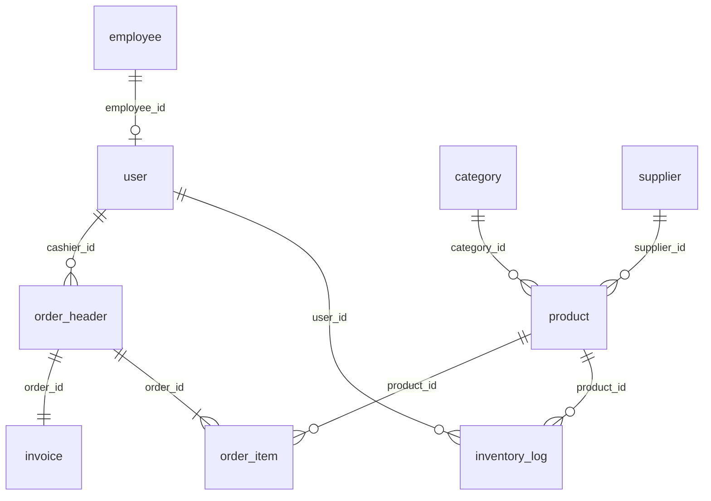

# Clothify Store — Database Reference

Database: `clothify_store_db` (MySQL 8+)  
Connection: see `src/main/resources/db.properties`

## Entity Relationship Diagram



## Full DDL

Run [`src/main/resources/db/schema.sql`](../src/main/resources/db/schema.sql) to create the database, tables, indexes, and seed data.

### Tables (9)

| Table | Primary Key | Description |
|-------|-------------|-------------|
| `employee` | `employee_id` | Store staff records |
| `user` | `user_id` | Login accounts (ADMIN/STAFF) |
| `category` | `category_id` | Product categories |
| `supplier` | `supplier_id` | Product suppliers |
| `product` | `product_id` | Catalog items with `image_path` |
| `inventory_log` | `log_id` | Stock movement audit trail |
| `order_header` | `order_id` | POS order header |
| `order_item` | `order_item_id` | Order line items |
| `invoice` | `invoice_id` | 1:1 invoice per order |

### Recommended Indexes

```sql
CREATE INDEX idx_order_header_date ON order_header(order_date);
CREATE INDEX idx_order_item_product ON order_item(product_id);
CREATE INDEX idx_invoice_no ON invoice(invoice_no);
```

## Repository SQL Queries

### Employee

```sql
-- findAll
SELECT * FROM employee ORDER BY employee_id;

-- findById
SELECT * FROM employee WHERE employee_id = ?;

-- save
INSERT INTO employee (name, phone, email, address, hire_date, active) VALUES (?,?,?,?,?,?);

-- update
UPDATE employee SET name=?, phone=?, email=?, address=?, hire_date=?, active=? WHERE employee_id=?;

-- delete
DELETE FROM employee WHERE employee_id = ?;

-- searchByName
SELECT * FROM employee WHERE name LIKE ? ORDER BY employee_id;
```

### User

```sql
-- findByUsername
SELECT u.user_id, u.username, u.password_hash, u.role, u.employee_id, e.name AS employee_name
FROM `user` u
LEFT JOIN employee e ON u.employee_id = e.employee_id
WHERE u.username = ?;

-- createUser
INSERT INTO `user` (username, password_hash, role, employee_id) VALUES (?,?,?,?);

-- deleteByEmployeeId
DELETE FROM `user` WHERE employee_id = ?;
```

### Category

```sql
SELECT * FROM category ORDER BY category_id;
SELECT * FROM category WHERE category_id = ?;
INSERT INTO category (category_name, description) VALUES (?,?);
UPDATE category SET category_name=?, description=? WHERE category_id=?;
DELETE FROM category WHERE category_id = ?;
```

### Supplier

```sql
SELECT * FROM supplier ORDER BY supplier_id;
SELECT * FROM supplier WHERE supplier_id = ?;
INSERT INTO supplier (supplier_name, phone, email, address) VALUES (?,?,?,?);
UPDATE supplier SET supplier_name=?, phone=?, email=?, address=? WHERE supplier_id=?;
DELETE FROM supplier WHERE supplier_id = ?;
SELECT * FROM supplier WHERE supplier_name LIKE ? ORDER BY supplier_id;
```

### Product

```sql
-- Base select (with joins)
SELECT p.product_id, p.product_name, p.description, p.image_path, p.price, p.qty_on_hand,
       p.category_id, p.supplier_id, c.category_name, s.supplier_name
FROM product p
LEFT JOIN category c ON p.category_id = c.category_id
LEFT JOIN supplier s ON p.supplier_id = s.supplier_id;

-- addProduct
INSERT INTO product (product_name, description, image_path, price, qty_on_hand, category_id, supplier_id)
VALUES (?,?,?,?,?,?,?);

-- editProduct
UPDATE product SET product_name=?, description=?, image_path=?, price=?, qty_on_hand=?, category_id=?, supplier_id=?
WHERE product_id=?;

-- deleteProduct
DELETE FROM product WHERE product_id = ?;

-- updateQuantity (non-transactional adjustment)
UPDATE product SET qty_on_hand = qty_on_hand + ? WHERE product_id = ?;

-- deductStock (transactional — fails if insufficient stock)
UPDATE product SET qty_on_hand = qty_on_hand - ?
WHERE product_id = ? AND qty_on_hand >= ?;

-- getQuantity
SELECT qty_on_hand FROM product WHERE product_id = ?;
```

### Inventory Log

```sql
INSERT INTO inventory_log (product_id, change_qty, reason, user_id) VALUES (?,?,?,?);

SELECT l.log_id, l.product_id, p.product_name, l.change_qty, l.reason,
       l.user_id, u.username, l.created_at
FROM inventory_log l
JOIN product p ON l.product_id = p.product_id
LEFT JOIN `user` u ON l.user_id = u.user_id
ORDER BY l.created_at DESC;
```

### Order (Place Order Transaction)

All steps below run inside a single JDBC transaction with `setAutoCommit(false)`. On any failure, `ROLLBACK` is issued.

```sql
-- 1. Create order header
INSERT INTO order_header (cashier_id, subtotal, tax, total, status) VALUES (?,?,?,?,?);

-- 2. For each cart item (deduct stock first — conditional update)
UPDATE product SET qty_on_hand = qty_on_hand - ?
WHERE product_id = ? AND qty_on_hand >= ?;
-- If rows affected = 0 → InsufficientStockException → ROLLBACK

-- 3. Insert order line
INSERT INTO order_item (order_id, product_id, qty, unit_price, line_total) VALUES (?,?,?,?,?);

-- 4. Log inventory change
INSERT INTO inventory_log (product_id, change_qty, reason, user_id) VALUES (?,?,?,?);

-- 5. Generate invoice number (within transaction, row lock)
SELECT COUNT(*) AS cnt FROM invoice WHERE invoice_no LIKE ? FOR UPDATE;

-- 6. Create invoice
INSERT INTO invoice (order_id, invoice_no) VALUES (?,?);

-- 7. COMMIT on success
```

### Invoice

```sql
INSERT INTO invoice (order_id, invoice_no) VALUES (?,?);

SELECT i.invoice_id, i.order_id, i.invoice_no, i.generated_at,
       o.subtotal, o.tax, o.total, e.name AS cashier_name
FROM invoice i
JOIN order_header o ON i.order_id = o.order_id
JOIN `user` u ON o.cashier_id = u.user_id
LEFT JOIN employee e ON u.employee_id = e.employee_id
WHERE i.order_id = ?;
```

### Report Queries

```sql
-- Sales summary
SELECT COUNT(*) AS order_count,
       COALESCE(SUM(total), 0) AS total_revenue,
       COALESCE(SUM(tax), 0) AS total_tax
FROM order_header
WHERE status = 'COMPLETED'
  AND DATE(order_date) >= ? AND DATE(order_date) <= ?;

-- Inventory summary
SELECT COUNT(*) AS total_skus,
       COALESCE(SUM(qty_on_hand), 0) AS total_units,
       SUM(CASE WHEN qty_on_hand < ? THEN 1 ELSE 0 END) AS low_stock_count
FROM product;

-- Top products
SELECT oi.product_id, p.product_name,
       SUM(oi.qty) AS total_qty_sold,
       SUM(oi.line_total) AS total_revenue
FROM order_item oi
JOIN order_header o ON oi.order_id = o.order_id
JOIN product p ON oi.product_id = p.product_id
WHERE o.status = 'COMPLETED'
  AND DATE(o.order_date) >= ? AND DATE(o.order_date) <= ?
GROUP BY oi.product_id, p.product_name
ORDER BY total_qty_sold DESC
LIMIT ?;

-- Daily sales
SELECT DATE(order_date) AS sale_date,
       COUNT(*) AS order_count,
       COALESCE(SUM(total), 0) AS revenue
FROM order_header
WHERE status = 'COMPLETED'
  AND DATE(order_date) >= ? AND DATE(order_date) <= ?
GROUP BY DATE(order_date)
ORDER BY sale_date;
```

## Seed Data

| Entity | Default |
|--------|---------|
| Admin user | `admin` / `admin123` (SHA-256 hash stored) |
| Categories | Men, Women, Kids |
| Sample products | Classic T-Shirt, Denim Jeans, Summer Dress (with image paths) |

## Drop Order (FK-safe)

```sql
DROP TABLE IF EXISTS invoice;
DROP TABLE IF EXISTS order_item;
DROP TABLE IF EXISTS order_header;
DROP TABLE IF EXISTS inventory_log;
DROP TABLE IF EXISTS product;
DROP TABLE IF EXISTS category;
DROP TABLE IF EXISTS supplier;
DROP TABLE IF EXISTS `user`;
DROP TABLE IF EXISTS employee;
```
