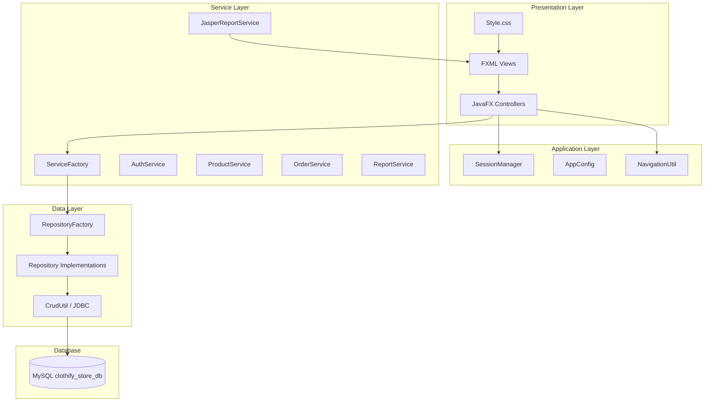

# Clothify Store — Project State & Architecture

**Version:** 1.0-SNAPSHOT  
**Type:** Desktop Point-of-Sale (POS) application for a clothing store  
**Last updated:** June 2026

---

## 1. Overview

Clothify Store is a **JavaFX desktop application** for managing a retail clothing store. It covers product catalog, inventory, suppliers, employees, POS checkout, invoicing, and sales reports. There is **no web frontend** and **no REST/API layer** — the JavaFX UI talks directly to the service layer, which uses JDBC to access MySQL.

---

## 2. Technology Stack

| Layer | Technology | Version / Notes |
|-------|------------|-----------------|
| Language | Java | 22 |
| UI framework | JavaFX (FXML + CSS) | 19 |
| Build tool | Maven | `pom.xml` |
| Database | MySQL | 8+ via `mysql-connector-j` 9.6.0 |
| Data access | JDBC | Raw SQL in repository implementations |
| Reports | JasperReports | 6.21.3 (PDF / print) |
| Boilerplate | Lombok | 1.18.42 (DTOs) |
| UI library (dependency) | JFoenix | 9.0.1 (included; primary styling uses custom CSS) |

### What is **not** used

- No Spring / Jakarta EE
- No Hibernate / JPA
- No React, Angular, or HTML/CSS/JS web frontend
- No REST API, WebSocket, or microservices
- No JavaScript runtime in the UI (animations use JavaFX CSS + `ScaleTransition`)

---

## 3. Architecture

The project follows a **layered desktop architecture** with manual dependency wiring through singleton factories.



### Layer responsibilities

| Package | Role |
|---------|------|
| `edu.icet.controller.*` | JavaFX controllers; handle UI events, bind tables/forms |
| `edu.icet.service` / `Impl` | Business logic, validation, transactions orchestration |
| `edu.icet.repository` / `Impl` | SQL queries, CRUD, report queries |
| `edu.icet.model.dto` | Data transfer objects between layers |
| `edu.icet.model.enums` | `UserRole`, `OrderStatus`, `InventoryReason` |
| `edu.icet.factory` | `ServiceFactory`, `RepositoryFactory` (singleton wiring) |
| `edu.icet.config` | `AppConfig`, `SessionManager` (auth session + RBAC) |
| `edu.icet.util` | Shared helpers (`NavigationUtil`, `AlertUtil`, `TableViewUtil`, `UiEffects`, etc.) |
| `edu.icet.db` | `DBConnection` singleton JDBC connection |

### Design patterns in use

- **MVC (JavaFX):** FXML = View, Controller = Controller, DTOs/Services = Model access
- **Repository pattern:** interfaces + JDBC implementations
- **Service layer:** business rules separated from UI and SQL
- **Singleton factories:** `ServiceFactory`, `RepositoryFactory`, `DBConnection`, `SessionManager`
- **DTO pattern:** entities passed between layers as plain Java objects

---

## 4. Frontend (JavaFX UI)

### Entry flow

1. `Main.java` → `Starter.java` (`javafx.application.Application`)
2. Loads `Login.fxml`
3. On success → `AppShell.fxml` (sidebar + dynamic content area)

### Shell layout

- **AppShell:** left sidebar navigation + central `StackPane` content area
- **NavigationUtil:** loads child FXML into the content area without replacing the whole window

### Screens (FXML)

| Screen | File | Purpose |
|--------|------|---------|
| Login | `Login.fxml` | Authentication |
| App shell | `AppShell.fxml` | Main layout + sidebar |
| Dashboard | `Dashboard.fxml` | Stats + quick access cards |
| Place Order (POS) | `Place_Order.fxml` | Product grid + shopping cart + checkout |
| Products | `Product_Management.fxml` | CRUD + catalog search |
| Categories | `Category_Management.fxml` | Category CRUD |
| Inventory | `Inventory_Management.fxml` | Stock levels + adjustments |
| Suppliers | `Supplier_Management.fxml` | Supplier CRUD (+ picker modal) |
| Employees | `Employee_Management.fxml` | Employee CRUD + staff login creation |
| Reports | `Reports.fxml` | Sales summary, charts tables, order search |
| Invoice preview | `Invoice_Preview.fxml` | Post-checkout invoice modal |

### Styling & UX

- **CSS:** `src/main/resources/css/Style.css` — modern flat theme (slate/blue palette)
- **Input effects:** `.modern-input` CSS classes + `UiEffects.java` (focus scale animation)
- **Tables:** `TableViewUtil.java` — all columns visible; last column stretches; no empty filler column
- **Assets:** `src/main/resources/images/` (logo, product placeholders)

---

## 5. Backend & Data

### Database

- **Name:** `clothify_store_db`
- **Config:** `src/main/resources/db.properties`
- **Schema:** `src/main/resources/db/schema.sql`
- **Full reference:** [DATABASE.md](./DATABASE.md)

### Connection

- Single shared JDBC connection via `DBConnection` singleton
- SQL executed through `CrudUtil` and repository `Impl` classes

### Core tables (9)

`employee`, `user`, `category`, `supplier`, `product`, `inventory_log`, `order_header`, `order_item`, `invoice`

### Default login (seed data)

| Username | Password | Role |
|----------|----------|------|
| `admin` | `admin123` | ADMIN |

Staff (cashier) accounts are created via **Employee Management** with “Create Staff Login” (`STAFF` role).

---

## 6. Authentication & Role-Based Access (RBAC)

| Role | DB value | UI label | Access |
|------|----------|----------|--------|
| Administrator | `ADMIN` | ADMIN | All modules |
| Cashier | `STAFF` | Cashier | Dashboard, Place Order, Invoice Preview only |

### Enforcement points

- **SessionManager.canAccess()** — route whitelist per role
- **NavigationUtil** — blocks unauthorized FXML loads with “Access Denied” alert
- **AppShellController** — hides admin sidebar buttons for STAFF
- **DashboardController** — hides admin quick-access cards for STAFF

---

## 7. Main Features (Current State)

| Module | Status | Notes |
|--------|--------|-------|
| Login / logout | Done | SHA-256 password hash |
| Dashboard stats | Done | Today orders, revenue, low stock count |
| POS / Place Order | Done | Category chips, product cards, cart, checkout |
| Invoicing | Done | DB record + JasperReports print/PDF |
| Product management | Done | Images, categories, suppliers, search/filter |
| Category management | Done | CRUD |
| Supplier management | Done | CRUD + picker from product form |
| Inventory management | Done | Stock in/out, low-stock row highlighting |
| Employee management | Done | CRUD + optional STAFF login |
| Reports | Done | Date range, top products, daily sales, order reprint |
| Modern UI theme | Done | Custom CSS, form animations |
| RBAC (Admin vs Cashier) | Done | Sidebar + route guards |

---

## 8. Reporting (JasperReports)

Templates in `src/main/resources/reports/`:

| File | Purpose |
|------|---------|
| `invoice.jrxml` | POS invoice / bill |
| `sales_summary.jrxml` | Sales summary report |
| `daily_sales.jrxml` | Daily breakdown |
| `top_products.jrxml` | Best-selling products |

Served by `JasperReportService` / `JasperReportServiceImpl`.

---

## 9. Project Structure

```
Clothify_Store/
├── pom.xml
├── docs/
│   ├── DATABASE.md          # Database schema reference
│   └── PROJECT_STATE.md     # This file
└── src/main/
    ├── java/edu/icet/
    │   ├── Main.java / Starter.java
    │   ├── config/          # AppConfig, SessionManager
    │   ├── controller/      # JavaFX controllers (by module)
    │   ├── db/              # DBConnection
    │   ├── factory/         # ServiceFactory, RepositoryFactory
    │   ├── model/dto/       # DTOs
    │   ├── model/enums/     # Enums
    │   ├── repository/      # Interfaces + Impl/
    │   ├── service/         # Interfaces + Impl/
    │   └── util/            # Helpers
    └── resources/
        ├── css/Style.css
        ├── db.properties
        ├── db/schema.sql
        ├── images/
        ├── reports/*.jrxml
        └── view/*.fxml
```

---

## 10. Configuration

`src/main/resources/db.properties`:

| Key | Example | Purpose |
|-----|---------|---------|
| `db.url` | `jdbc:mysql://localhost:3306/clothify_store_db` | JDBC URL |
| `db.user` | `root` | DB username |
| `db.password` | `****` | DB password |
| `app.tax.rate` | `0.0` | Tax rate for checkout |
| `app.low.stock.threshold` | `5` | Low stock warning level |
| `app.store.name` | `Clothify Store` | Store name on invoices |

---

## 11. How to Run

**Prerequisites:** JDK 22, Maven, MySQL 8+ with schema applied

```bash
# 1. Create database
mysql -u root -p < src/main/resources/db/schema.sql

# 2. Update db.properties if needed

# 3. Run with Maven JavaFX plugin
mvn javafx:run
```

Or run `edu.icet.Starter` from your IDE with JavaFX VM options.

---

## 12. Known Limitations

- Single JDBC connection (not a connection pool)
- No automated unit/integration tests in the repo
- Desktop-only; no mobile or web client
- Password hashing is SHA-256 (not bcrypt/Argon2)
- JFoenix is on the classpath but the app primarily uses custom CSS

---

## 13. Related Documentation

- [DATABASE.md](./DATABASE.md) — ERD, tables, indexes, seed data, query notes
